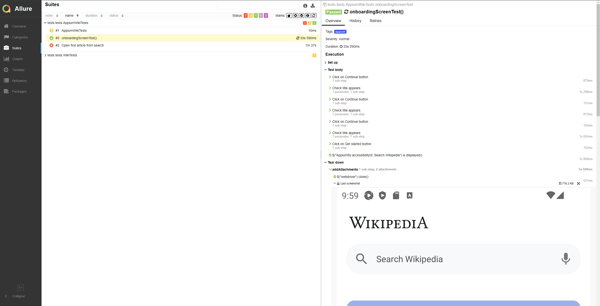

# Проект по мобильной автоматизации тестовых сценариев для приложения WikiPedia
## :scroll: Содержание:

- [Используемый стек](#computer-используемый-стек)
- [Запуск автотестов](#arrow_forward-запуск-автотестов)
- [Пример Allure-отчета](#arrow_forward-пример-отчета-allure)
- [Пример видео запуска тестов через Appium](#arrow_forward-Пример-видео-запуска-тестов-через-Appium)


## :computer: Используемый стек

<p align="center"> 
Java
Appium
BrowserStack
Selenide
Selenoid
Allure Report
Gradle
JUnit5
Jenkins


</p>

В данном проекте находятся UI мобильные автотесты для приложения WikiPedia. Для создания тестов использовалась Java 17 и сборщик Gradle.
Тесты могут запускаться как через сайт BrowserStack, так и на эмуляторе Appium.


## :arrow_forward: Запуск автотестов

### Запуск тестов из терминала
```
gradle clean test -Denv=appium - запуск на устройстве локально с помощью Appium
gradle clean test -Denv=browserstack - запуск через сайт BrowserStack
```

## :arrow_forward: Пример отчета Allure

### Результат выполнения автотеста

<p align="center">

</p>

## :arrow_forward: Пример видео запуска тестов через Appium


